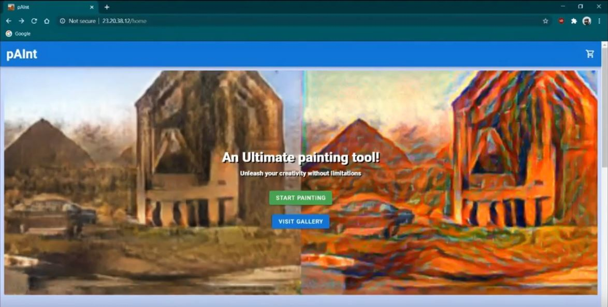

# pAInt

## About
- Built with [Pytorch](https://pytorch.org/) for [Pytorch Summer Hackathon 2020]([https://pytorch2020.devpost.com/](https://pytorch2020.devpost.com/)), pAInt can be called as an AI augmented painting tool.
- The user can sketch anything he/she wants and let AI complete the art with best in class Artistic style transfers and styling with a custom image
- The experience also involves a gallery consisting of some of the art completed by fellow artists and a cart that allows the user to simply download artwork from the application
- Uses [Pix2Pix](https://phillipi.github.io/pix2pix/) model for image to image translation and [Bicycle GAN](https://github.com/junyanz/BicycleGAN) and [Cycle GAN](https://junyanz.github.io/CycleGAN/) to generate diffrent variations of the synthesised image. Neural Style transfer was used to give a customized artistic touch for the final output.
- Includes a canvas forked from [JS Paint](https://github.com/1j01/jspaint) which resembles MS Paint from the windows 90s era.
- The app was built with a typescript backend and a VueJS front end. The Typescript backend calls Python scripts that handles the ML tasks with Pytorch.
- The repo contains two folders [/paint/](paint/) and [/paint-frontend/](paint-frontend/). These contain the code for backend and frontend respectively.
- The backend uses the folder [/paint/wwwroot/](paint/wwwroot) as the public or static directory and this is the place where the compiled distribution files of the frontend are placed.
- You may find the codes of Deep Learning models used within [/paint/ml/](paint/ml) directory. 
- You may find the modified code of [JS Paint](https://github.com/1j01/jspaint) within the repo at [/paint/wwwroot/paint/](paint/wwwroot/paint).

## DEMO video
The site is currently down. So you cannot try the web application by yourself. But however, you can watch [this youtube video](https://www.youtube.com/watch?v=A6L7rqu0yIA) which shows our DEMO of the application.

## Pre-trained checkpoints
* Under [./paint/ml/image_synthesis](./paint/ml/image_synthesis), paste the `checkpoints` folder from [here](https://drive.google.com/drive/folders/1EO5UDBFFyw6y5vdXPshr5xCMlpkp6xy1?usp=sharing)
* Under [./paint/ml/style_branch/custom_style](./paint/ml/style_branch/custom_style), paste the `models` folder from [here](https://drive.google.com/drive/folders/1RFVAOL2YSXEVY1yoqY_IUP7JUwpbIZiR?usp=sharing)
* Under [./paint/ml/style_branch/style_gen](./paint/ml/style_branch/style_gen), paste the `checkpoints` folder from [here](https://drive.google.com/drive/folders/192zNcoc8qdajJ6WiIh_Jd0K801bCSVXt?usp=sharing)
* Under [./paint/ml/style_branch/variation_gen](./paint/ml/style_branch/variation_gen), paste the `checkpoints` folder from [here](https://drive.google.com/drive/folders/1Rr1nSo7yxNWr14WT5Hs4qIjSvv0w5sX4?usp=sharing)

## Usage
* Deploy the backend to a server with a unix based shell that supports "&&" to chain two commands together and has an NVIDIA GPU attached.
* You must have [python](https://www.python.org/) or [conda](https://docs.conda.io/) set up with all requirements as given in [/paint/ml/conda_env.yml](paint/ml/conda_env.yml) and [/paint/ml/conda_env_spec.txt](paint/ml/conda_env_spec.txt)
* Note that this project uses [GIT LFS](https://git-lfs.github.com/). So you'll have to install [GIT LFS](https://git-lfs.github.com/) and fetch all the LFS files

## Authors
* [RA Keerthan](https://github.com/keerthan2)
* [Hari R](https://www.github.com/haricane8133)
* [Subrahmanyam](https://github.com/Subrahmanyam2305)
